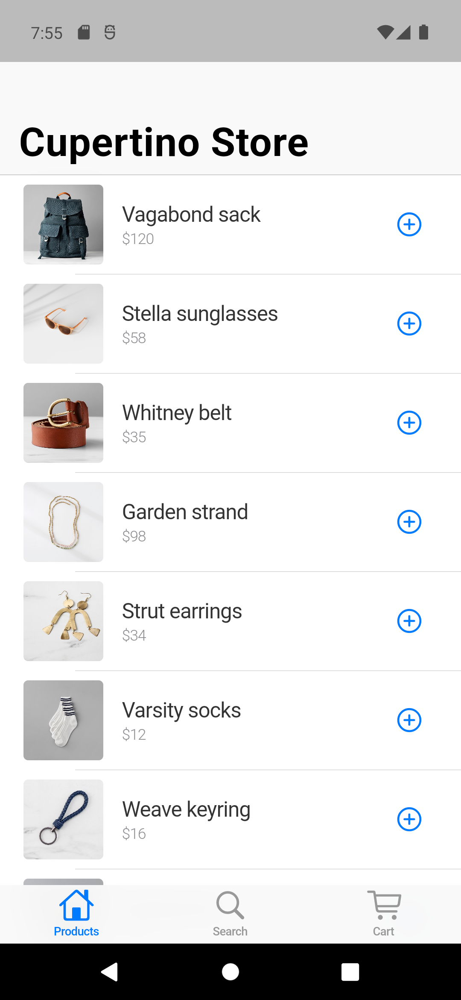
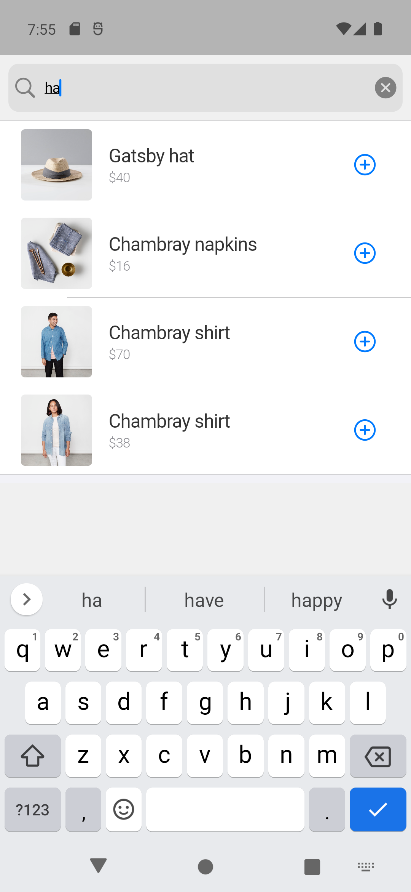
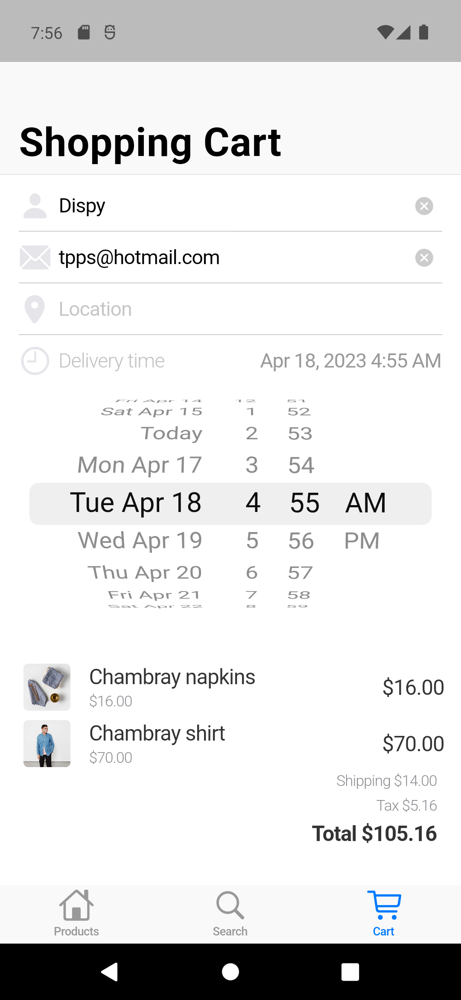

# Cupertino Store

以 Flutter 開發的 iOS 風格應用程式，相容於 Android 和 iOS。

## 規格

最低相容 Flutter SDK 版本：3.7（因應 CupertinoListTile 等套件是在 3.7 才提供）

## 內容

用 iOS 風格元件，設計一款購物 app。

本 app 的重點是示範元件的應用，沒有連線到網路。

## 參考資料

[Building a Cupertino app with Flutter](https://codelabs.developers.google.com/codelabs/flutter-cupertino#0)
